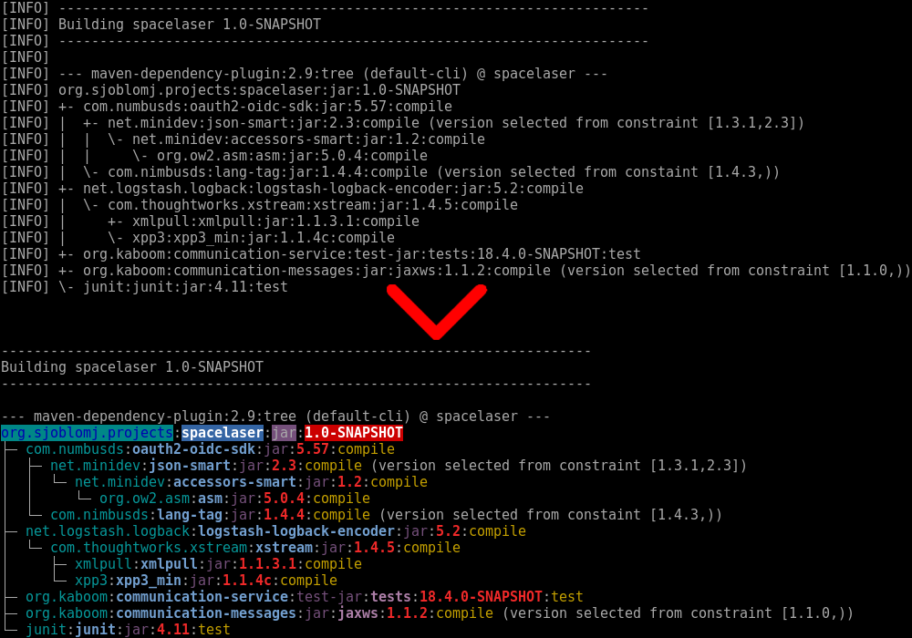

# mvntree


## About
When developing Java applications with [Maven](https://en.wikipedia.org/wiki/Apache_Maven), you soon find yourself dealing with dependency problems. You may have multiple dependencies that bring in incompatible versions of libraries that cause problems. A nice way to see the dependencies in a project is by generating a Maven dependency tree by running `mvn dependency:tree`. The command is not that pretty though.

This is a small awk script to prettify the Maven dependency tree. It will turn the ascii tree from the crude form that Maven outputs into something a little prettier. The different columns in the dependencies will have nice colours applied to them. Finally, the superfluous "[INFO] " at the start of each line is removed to save space.

## Installation
This acts as shell alias. You have two ways of loading the command:
1. You can copy the content of the file '.mvntree' into your ~/.zshrc or ~/.bashrc file.
2. You can load the file directly. Assuming you have placed '.mvntree' in your home folder, you can place the following in ~/.zshrc:

```
source $HOME/.mvntree
```

In ~/.bashrc:

```
if [ -f ~/.mvntree ]; then
    . ~/.mvntree
fi
```

You can now use the command `mvntree` and enjoy the prettiness.
